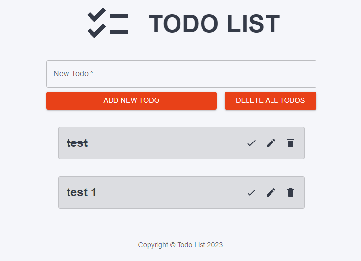

# Todo-Application

- Todo application for SQA assignment 2

## <ins>Project Description</ins> SUMAIR

This project is a simple To-Do list application, created to enable users to track what tasks they have completed, and what they still have left to do. The program has been designed to be used for a plethora of different purposes, some of which may include tracking your chores, shopping, or daily tasks.

### **Here are the features included in the application:**
- Add new todo items
- Delete todo items
- Edit a todo item
- Delete all todo items

The application features a simple and easy to use UI, with a singular page, that can dynamically scale as todo items are added.

### Empty todo list:


### Todo list with items:


### Checked todo item:


### Edit todo item modal:


## <ins>Team Description</ins> SUMAIR
Our team consisted of only two members. Due to this, each member undertook multiple roles in the team. Despite having individual roles, we wore multiple hats and discussed features collaboratively in our daily standups. 

**Abdul-Subhan Latif** - Abdul-Subhan was the lead QA tester on the team. His role in the project entailed writing tests for the application and ensuring SQA practices were implemented throughout the project lifecycle. Alongside this, Abdul-Subhan was heavily involved in the planning stage, designing the initial Figma for the Front-End and outlining the functional and non-functional requirements for the project.

Abdul-Subhan Key Roles:
- Writing tests
- Implementing linting checks
- Implementing code formatter
- SQA practices
- Reviewing pull requests
- Smoke testing pull requests
- Lead designer
- Contributing to documentation
  
**Sumair Ruhani** - Sumair was the lead developer on the team. He designed and implemented the core functionality for the To-Do app, alongisde styling it based on the Figma designs. Alongside this, Sumair was responsible for ensuring CI/CD practices were implemented in the project, by writing GitHub actions and Git Hooks. 

Sumair Key Roles:
- Writing the program
- Git Hook for enforcing conventions
- Implementing automated testing
- CI/CD practices
- Reviewing pull requests
- Smoke testing pull requests
- Project Manager
- Contributing to documentation
  
Both members of the team evenly split the workload between themselves, with one primarily focused on developing the app and implementing CI/CD practices, while the other was focused on writing tests and ensuring SQA practices where met. Therefore, the contribution from each member was 50% each.

_Note: The line contributions is **NOT** an accurate reference for the contributions from each member, due to an error where the `node_modules` (prewritten packages) were committed alongside the rest of the code, causing the lines committed to be more than it should be for one member._
_For a more accurate representation of code contribution, please go through each pull request, to view contributions from each member. This can be done using the search filter on the pull requests tab of the repository and setting the filter to: `is:pr is:merged`_

## <ins>Tools Used</ins> SUMAIR

- version control - GitHub
Version & source control
Reviewing
Pipeline tests

- testing - Jest / React Testing Library
Unit testing (of components, main page)
Integration tests (functionality)

- test code coverage
Code Cov (TO DO)

- frameworks and libraries - React / MUI
React - for FE
Material UI (MUI) - premade components

### _Linters_

_ESLint_

This project utilisies ESLint for analysing JavaScript code for potential errors, styling issues, and adherence to coding standards.
ESLint rules have been defined by the team in the .eslintrc.js file, in rukles for errors, warnings and styling have been customised.
ESLint has been integrated in the `package.json` file to run after each commit and after each push.
To manually run the linter on the code, run the command:

```
npx eslint .
```

Prettier - code formatting

- project management tools
Figma - designs
Jira - kanban board
Git - version controlling

- performance and accessibility audit
Google Lighthouse (TO DO)

## <ins>Instructions to Run the Application</ins> ABDUL-SUBHAN

- how the project can be cloned and run
Open GitHub link
Git clone link
At root level, `npm run start`

- how to use the application
Add text in textbox, press add button
Edit button to open modal to change text
Done button to strikethrough text to mark as done
Delete button to delete todo
'Delete all' button to delete all todos

## <ins>Project Workflow</ins> ABDUL-SUBHAN

- project management strategies
Agile methodology: Scrum-Kanban hybrid
Trunk-based development

- retrospectives
Daily stand-ups, give updates. Sometimes done over chat instead of a call - allowing greater flexibility and greater logging of chats

- kanban board
Jira board

## <ins>Test Methodologies and Tools</ins> ABDUL-SUBHAN

- Types of tests done
Unit testing (components + main page) + UI testing
Integration testing (functionalities)
Pipeline tests
Smoke testing after each PR 
Manual testing after PR merged, also at random times (written and followed test plans)
Code cov

- evidence of test methods and tools (tables of tests, snapshots, code coverage)
Test tables
Test plans
Snapshots
Code cov
Pipeline tests ss

## <ins>Coding Best Practices</ins> ABDUL-SUBHAN

- best coding practices applied
Variable naming conventions
File & function naming
Repo structure

- Linter 
(eslint)
Git Hook added
Pre-commit
Pre-push

- Formatter 
(prettier)
Pre-commit
- (mention trunk-based development) 
- (conventional commits)

- _Git Hooks_

Git hooks are scripts that Git automatically executes primarily on a local machine before or after events (like committing, pushing, pulling, etc).
These hooks tailor the Git workflow to project-specific needs by enforcing coding standards, running tests, and preventing commits that don't meet predefined criteria.
Default Git hooks are stored in `./.git/hooks`.
Created hooks are kept in `./git-hooks`
The hooks created for this project are:

### _Branch naming conventions_

Branches should be identified as feature|task|bugfix|hotfix, followed by the JIRA task id and a description, for example:

```
feature/TODO-999_enforce_branch_naming_conventions
```

To ensure that branch names adhere to the specified conventions, we have set up a Git hook. Follow the steps below to set up the hook in your local repository.

Make the script file executable:

```
chmod +x setup-hooks.sh
```

Run the script file to download and set up the git hook:

```
./setup-hooks.sh
```

## <ins>CI Pipeline</ins> SUMAIR

- how the CI pipelines were set up

- snapshots of test suite results
Pipeline screenshots

- PR strategies applied
Trunk-based development

(make note about cannot merge until reviewed)
(explain how actions work)

### _GitHub Actions_

GitHub Actions are workflows defined in code, stored alongside the code in a repository. GitHub Actions automate the SDLC, from building and testing to deploying. They are triggered by events, and executed in GitHub-hosted runners, allowing easy integration with GitHub repositories. Likewise, they sit directly in the GitHub Pipeline, dictating what can be merged into the codebase, based on their outcomes.

The GitHub Actions integrated in this repository are:

- **Automatic Reviewer assign** - Whenever a pull request is created, an appropriate reviewer is assigned. Since our project had two members, whenever one member created a pull request, the action automatically assigned the other member as a required reviewer. The reviewer recieves an email notification informing them that they need to review the pull request. This removes the need for the developer to manually add reviewers. Likewise, this prevents the situation where users forget to assign reviewers to their pull request, resulting in it sitting and becoming stale, which is bad practice.

- **Automatic author assign** - Whenever a pull request is created, the creator of it is automatically assigned as the author. This removes the step for developers to manually assign themselves as an author (which is often forgotten about) and ensures the reviewer knows who was responsible for the pull request. Although this feature isn't necessarily required with only 2 people working in the codebase, it is a good practice to implement regardless. 

_Note: The automatic reviewer assign and automatic author assign features have been created as part of the same GitHub action_

- **Automated testing** - An Action has been written to automatically run all tests within the codebase in the pipeline, including all unit tests and integration tests. The action is triggered whenever a pull request is created, or updated. It runs using NodeJS in the GitHub pipeline and will log all of the tests that have successfully passed or failed during the testing process. If any tests fail, they are logged, and merging will be blocked until it is fixed. This ensures that only high quality code that passes the tests are merged.

## <ins>Standards</ins> ABDUL-SUBHAN

- description of a standard (like IEEE730)
- reason for choosing the standard
- key features of standard applied

## <ins>Performance and Accessibility Audit</ins> ABDUL-SUBHAN

- tools used to check performance and accessibility of application
- snapshots of key results
- analyse results

(UIUX stuff about colours matching, colour theory, simplistic design etc)
